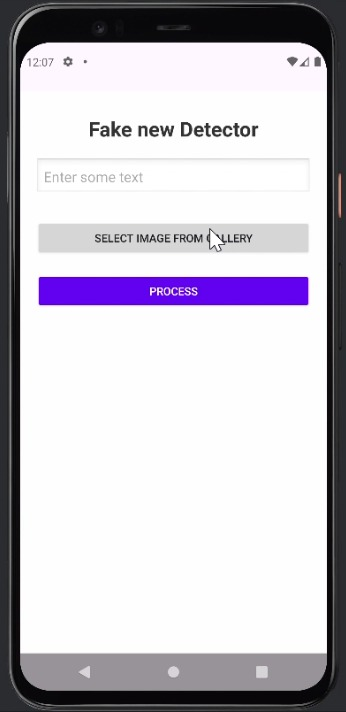
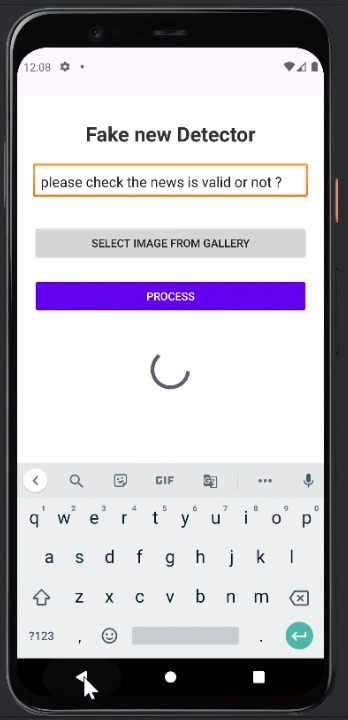
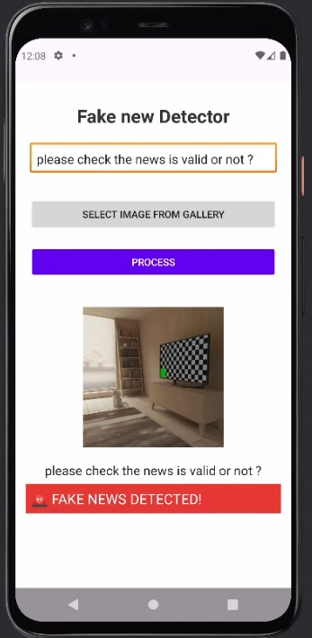

<h1 align="center">📰 Fake News Detector - Android App (AI + ML + UI)</h1>

<p align="center">
  
  
  
  
</p>

<p align="center">
  An AI-based Android App to detect whether a news article is <b>Fake</b> or <b>Real</b> using a pre-trained ML model in TensorFlow Lite.
</p>

---

## 📱 Screenshots

| Input & Button | Loading | Result |
|----------------|---------|--------|
|  |  |  |

---

## ⚙️ Features

- 🧠 AI-powered fake news classifier using TFLite
- 📷 Select image from gallery and preview
- ✍️ Type custom news content and detect fake or real
- 💬 Displays dynamic results with colored output
- 🔄 Smooth UI/UX with loader and preview handling

---

## 📂 Project Structure

```bash
├── app/
│   ├── src/
│   │   ├── main/
│   │   │   ├── assets/
│   │   │   │   └── fake_news_model.tflite
│   │   │   ├── java/
│   │   │   │   └── com/example/mediaprocessor/
│   │   │   │       ├── MainActivity.java
│   │   │   │       └── FakeNewsClassifier.java
│   │   │   ├── res/
│   │   │   │   └── layout/
│   │   │   │       └── activity_main.xml
│   │   │   └── AndroidManifest.xml
├── build.gradle
├── README.md

```
---

## 🧠 ML Model Used

| Model | Type |
|-------|------|
| [`bert-tiny-finetuned-fake-news`](https://huggingface.co/mrm8488/bert-tiny-finetuned-fake-news) | Pre-trained BERT Tiny |
| Converted to | TensorFlow Lite (.tflite) |

---

## 🛠️ How to Use

### Step 1: Clone the Repository
```bash
git clone https://github.com/your-username/fake-news-detector-android.git
cd fake-news-detector-android
```

### Step 2: Open in Android Studio
Open the project in Android Studio and let it sync all Gradle dependencies.

### Step 3: Add TFLite Model
Place your `fake_news_model.tflite` in:
```
app/src/main/assets/
```

### Step 4: Add Required Dependencies
Inside `build.gradle (Module: app)`:

```gradle
dependencies {
    implementation 'org.tensorflow:tensorflow-lite:2.10.0'
    implementation 'org.tensorflow:tensorflow-lite-support:0.3.1'
}

android {
    aaptOptions {
        noCompress "tflite"
    }
}
```

---

## 🖼️ UI Layout (XML)

<details>
<summary>Click to expand</summary>

```xml
<?xml version="1.0" encoding="utf-8"?>
<RelativeLayout xmlns:android="http://schemas.android.com/apk/res/android"
    xmlns:tools="http://schemas.android.com/tools"
    android:id="@+id/rootLayout"
    android:layout_width="match_parent"
    android:layout_height="match_parent"
    android:background="#fefefe"
    tools:context=".MainActivity">

    <TextView
        android:id="@+id/title"
        android:layout_width="match_parent"
        android:layout_height="wrap_content"
        android:text="Fake News Detector"
        android:textSize="26sp"
        android:gravity="center"
        android:textStyle="bold"
        android:textColor="#333"
        android:layout_marginTop="30dp" />

    <EditText
        android:id="@+id/inputText"
        android:layout_width="match_parent"
        android:layout_height="wrap_content"
        android:hint="Enter some text"
        android:layout_below="@id/title"
        android:layout_margin="20dp"
        android:background="@android:drawable/edit_text"
        android:padding="10dp"/>

    <Button
        android:id="@+id/selectImageBtn"
        android:layout_width="match_parent"
        android:layout_height="wrap_content"
        android:text="Select Image from Gallery"
        android:layout_below="@id/inputText"
        android:layout_marginHorizontal="20dp"
        android:layout_marginTop="10dp"/>

    <Button
        android:id="@+id/processBtn"
        android:layout_width="match_parent"
        android:layout_height="wrap_content"
        android:text="Process"
        android:layout_below="@id/selectImageBtn"
        android:layout_margin="20dp"
        android:backgroundTint="#6200EE"
        android:textColor="#fff" />

    <ProgressBar
        android:id="@+id/loader"
        style="?android:attr/progressBarStyleLarge"
        android:layout_width="60dp"
        android:layout_height="60dp"
        android:layout_below="@id/processBtn"
        android:layout_centerHorizontal="true"
        android:layout_marginTop="20dp"
        android:visibility="gone"/>

    <ImageView
        android:id="@+id/imagePreview"
        android:layout_width="200dp"
        android:layout_height="200dp"
        android:layout_below="@id/loader"
        android:layout_centerHorizontal="true"
        android:scaleType="centerCrop"
        android:layout_marginTop="20dp"
        android:visibility="gone"/>

    <TextView
        android:id="@+id/textPreview"
        android:layout_width="wrap_content"
        android:layout_height="wrap_content"
        android:text=""
        android:layout_below="@id/imagePreview"
        android:layout_centerHorizontal="true"
        android:textSize="18sp"
        android:textColor="#222"
        android:layout_marginTop="20dp"
        android:visibility="gone"/>
</RelativeLayout>
```

</details>

---

## 🧑‍💻 Developer

> **Lavina Sevani**  
> 3rd Year CSE | Poornima Institute of Engineering & Technology  
> 🏡 Jaipur| 💬 Java |Salesforce | Android | Cloud  
> 🔗 [LinkedIn](https://www.linkedin.com/in/lavina-sevani/)

---

## 📝 License

This project is licensed under the MIT License - see the [LICENSE](LICENSE) file for details.

---

## 🌟 Show Your Support

If you like this project, don't forget to ⭐️ star it on GitHub and share it with others.  
Pull requests and contributions are most welcome!


